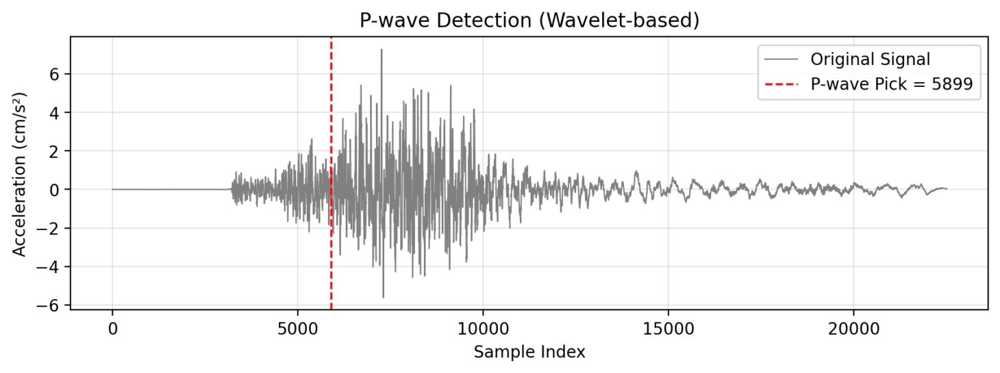
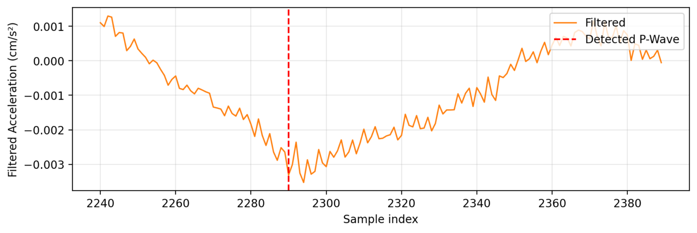

# 🌋 **P-Wave Detection Using Wavelet Transform**

This project focuses on detecting the arrival of seismic **P-waves** — the first waves generated during an earthquake — using a **wavelet-based signal processing** approach.

Unlike simple amplitude thresholds or STA/LTA ratios, this method analyzes signals across multiple frequency levels using the **Discrete Wavelet Transform (DWT)**.  
By isolating high-frequency components that appear first when a P-wave arrives, the system can detect seismic activity **more accurately and earlier**.

---

## ⚙️ **Pipeline Overview**

1. **Preprocess** the seismic signal (filtering and normalization)  
2. **Apply Wavelet Transform** to extract high-frequency detail coefficients  
3. **Reconstruct** the high-frequency signal and compute its **envelope (Hilbert Transform)**  
4. **Threshold & Refine** the detection point by backtracking to the wave onset  

The result is a clear visualization of both the **original seismic signal** and the **detected P-wave arrival**, helping researchers analyze event timing with greater precision.

---

## 💡 **Key Features**

- Wavelet-based signal decomposition and reconstruction  
- Automatic detection of first P-wave arrival  
- Smoothed envelope and adaptive thresholding for robust picks  
- Visualization comparing filtered signals and detection points  

---

## 🧠 **Tech Stack**

- **Python**  
- **NumPy**, **SciPy**, **PyWavelets**, **Matplotlib**  
- **Streamlit** *(for interactive visualization)*  

---

## 📈 **Output Overview**

The generated plots display:

- Original acceleration signal with **P-wave mark** *(red dashed line)*  
- Filtered/high-frequency component showing the **sharp onset** of the P-wave  

---

## 🧠 **AI/ML Relevance**

Applies **wavelet-based signal processing** and **statistical analysis** to extract meaningful features from sensor data, forming a strong foundation for **AI/ML-driven event detection** in the future.

---

## 🚀 **How to Run**

1️⃣ Clone the Repository

git clone https://github.com/yourusername/pwave-detection.git
cd pwave-detection

2️⃣ Install Dependencies

pip install -r requirements.txt

3️⃣ Run the Core Script

python main.py --file "data/sample.v2c" --fs 100

4️⃣ (Optional) Run with Streamlit Interface

streamlit run app.py

Then open: http://localhost:8501

---

## 🧩 **Example Outputs**

Wavelet-based Detection:

STA/LTA Comparison:

---

